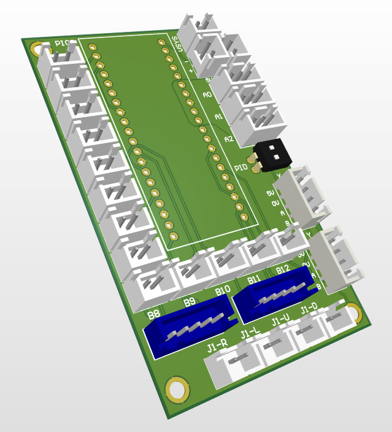

This is the firmware and PCB design for a low-latency USB controller for arcade controls - buttons, joysticks (digital and analog), and mouse-like things (spinners & trackballs).

It's based around the Raspberry Pi Pico board which provides all of the GPIO and USB functionality.

[TinyUSB](https://github.com/hathach/tinyusb) is used from the [pico SDK](https://github.com/raspberrypi/pico-sdk) to handle the USB communication.

The quadrature encoder is implemented using Jamon's code [here](https://github.com/jamon/pi-pico-pio-quadrature-encoder)

To build:

* Clone the repo and update certain submodules.

   **Note**: if you use `--recurse-submodules` here it will take a long time
```
   git clone https://github.com/garyjsweet/arcade_ctrl.git
   cd arcade_ctrl
   git submodule init
   git submodule update
   cd pico-sdk/
   git submodule init
   git submodule update
```

* Make an out-of-tree build folder and configure cmake
   Use `<PATH_TO_THIS_REPO>/pico-sdk/cmake/preload/toolchains/pico_arm_gcc.cmake` as the toolchain file. **If you have an existing build, be sure to `make clean` and `make rebuild_cache`**

* Ensure you have an appropriate `arm-none-eabi-gcc` compiler toolchain installed for the pico.

* `cd` into your build folder and `make` or `make -j`

* Connect the pico board to your PC whilst holding down the `bootsel` button on the pico board.

* Drag and drop the `ArcadeCtrl.uf2` from the build folder onto the pico
   Note: The led on the pico should now be blinking roughly once per second.

* Move to USB to your target host device and enjoy.